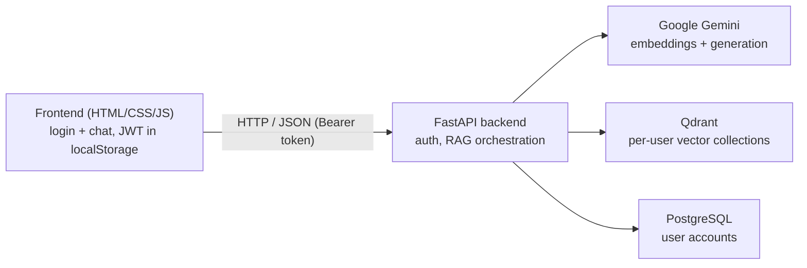

# PDF Chat (RAG)


A production-oriented, full-stack web application that lets users upload PDF
documents and ask questions about them in natural language. Answers are generated
by a Large Language Model (Google Gemini) and grounded strictly in the uploaded
documents using a Retrieval-Augmented Generation (RAG) pipeline, with per-answer
source citations.

**Live demo:** _add your deployment URL here_

---

## Overview

Large Language Models do not have access to a user's private documents and can
produce confident but incorrect answers. This project addresses that with
Retrieval-Augmented Generation (RAG): instead of relying on the model's memory,
the application retrieves the most relevant passages from the uploaded PDFs and
asks the model to answer using only that context. The model is instructed to say
it does not know when the answer is not present, which reduces hallucinations,
and every answer is shown with the document and page it came from.

The application is built as a decoupled system: a REST API backend and a static
browser frontend, with user authentication, per-user data isolation, persistent
storage, containerisation, automated tests and continuous integration.

## Features

- Upload and query multiple PDF files in natural language.
- Answers grounded strictly in the source documents, with document and page
  citations for each answer.
- User accounts with secure authentication (registration, login, logout).
- Multi-tenancy: each user's documents are fully isolated from other users.
- Persistent vector search (documents survive restarts and are stored per user).
- Privacy controls (GDPR): users can delete their documents or their entire account.
- Resilient AI calls with automatic retries, exponential backoff and a fallback model.
- Structured logging with per-request tracing and optional error tracking.
- Containerised stack (app + vector database + relational database) and a CI pipeline.

## Architecture

The application is split into a static frontend and a REST API backend. The
backend orchestrates the RAG pipeline and talks to a vector database (Qdrant) for
document embeddings and a relational database (PostgreSQL) for user accounts.



RAG pipeline (ingestion runs once per upload; retrieval and generation run per question):

| Step | Responsibility | Module |
|------|----------------|--------|
| 1. Load | Extract text from each PDF, with page numbers | `rag/loader.py` |
| 2. Chunk | Split text into overlapping chunks, keeping source/page | `rag/chunker.py` |
| 3. Embed | Convert chunks into vectors via Gemini (parallel + cached) | `rag/embedder.py` |
| 4. Store | Save vectors in the user's Qdrant collection | `rag/vectorstore.py` |
| 5. Retrieve | Find the most relevant chunks for a question | `rag/vectorstore.py` |
| 6. Generate | Prompt Gemini with the question and retrieved context | `rag/chain.py` |
| Orchestrate | Tie the steps together per user | `rag/service.py` |

## Tech Stack

- **Language:** Python
- **Backend / API:** FastAPI, Uvicorn
- **Frontend:** HTML, CSS, JavaScript (no framework)
- **LLM:** Google Gemini (`gemini-2.5-flash`, fallback `gemini-2.0-flash`)
- **Embeddings:** Google Gemini (`gemini-embedding-001`)
- **Vector database:** Qdrant
- **Relational database:** PostgreSQL (SQLite for local development), SQLAlchemy ORM
- **Auth:** JWT (python-jose), bcrypt password hashing
- **PDF parsing:** PyMuPDF
- **Text splitting:** LangChain text splitters
- **Testing:** pytest
- **CI:** GitHub Actions
- **Containerisation:** Docker, Docker Compose

## Project Structure

```
pdf-chat-rag/
├── api.py                  # FastAPI app: endpoints, auth, middleware
├── config.py               # Central configuration (env-overridable)
├── gemini_client.py        # Shared Gemini client: retries, fallback, cache
├── observability.py        # Logging, request tracing, optional Sentry
├── auth/
│   └── security.py         # Password hashing + JWT
├── db/
│   ├── database.py         # SQLAlchemy engine/session
│   └── models.py           # User model
├── rag/
│   ├── loader.py           # PDF text extraction (with pages)
│   ├── chunker.py          # Text chunking (keeps metadata)
│   ├── embedder.py         # Gemini embeddings (parallel)
│   ├── vectorstore.py      # Qdrant store/search/delete
│   ├── chain.py            # Answer generation
│   ├── citations.py        # Source formatting
│   └── service.py          # Per-user RAG orchestration
├── frontend/
│   ├── index.html          # Login / register page
│   ├── chat.html           # Chat page
│   └── static/             # CSS + JS
├── tests/                  # pytest suite (mocked Gemini)
├── Dockerfile
├── docker-compose.yml      # api + qdrant + postgres
├── requirements.txt
├── requirements-dev.txt
├── pytest.ini
└── .github/workflows/ci.yml
```

## API Reference

| Method | Endpoint | Auth | Description |
|--------|----------|------|-------------|
| GET | `/health` | No | Health check |
| POST | `/register` | No | Create an account (email + password) |
| POST | `/login` | No | Log in, returns a JWT access token |
| GET | `/me` | Yes | Current user |
| GET | `/status` | Yes | Whether the user has documents ready |
| POST | `/process` | Yes | Upload PDFs to be processed and stored |
| POST | `/ask` | Yes | Ask a question, returns an answer with sources |
| DELETE | `/me/documents` | Yes | Delete all of the user's documents |
| DELETE | `/me` | Yes | Delete the user's account and all their data |

Interactive API documentation (Swagger UI) is available at `/docs` when the app
is running.

## Getting Started (Local)

### Prerequisites

- Python 3.13
- A Google Gemini API key ([Google AI Studio](https://aistudio.google.com/app/apikey))

### Setup

```bash
# 1. Clone and enter the project
git clone https://github.com/akrourmoh/pdf-chat-rag.git
cd pdf-chat-rag

# 2. Create and activate a virtual environment
python -m venv .venv
# Windows:        .venv\Scripts\activate
# macOS / Linux:  source .venv/bin/activate

# 3. Install dependencies
pip install -r requirements.txt

# 4. Configure environment
cp .env.example .env          # then edit .env and add your keys

# 5. Run the app
uvicorn api:app --reload --port 8000
```

Open `http://localhost:8000`, register an account, log in, upload a PDF and ask a
question. Locally the app uses SQLite for users and a local on-disk Qdrant, so no
external services are required.

## Running with Docker

Runs the full stack (API + Qdrant + PostgreSQL) with one command:

```bash
docker compose up --build
```

Then open `http://localhost:8000`. Data persists in Docker volumes between runs.
Use `docker compose down` to stop, or `docker compose down -v` to also remove the
stored data.

## Configuration

All settings are read from environment variables (see `.env.example`).

| Variable | Required | Default | Description |
|----------|----------|---------|-------------|
| `GOOGLE_API_KEY` | Yes | – | Google Gemini API key |
| `JWT_SECRET` | Yes (prod) | dev default | Secret used to sign login tokens |
| `DATABASE_URL` | No | SQLite | SQLAlchemy connection string (PostgreSQL in prod) |
| `ENVIRONMENT` | No | `development` | `production` enforces secure settings at startup |
| `QDRANT_URL` | No | local on-disk | Hosted Qdrant URL (e.g. Qdrant Cloud) |
| `QDRANT_API_KEY` | No | – | API key for hosted Qdrant |
| `EMBED_CONCURRENCY` | No | `8` | Parallel embedding requests |
| `SENTRY_DSN` | No | – | Enables Sentry error tracking if set |

## Testing

The test suite mocks the Gemini API, so it runs offline, fast and free.

```bash
pip install -r requirements-dev.txt
pytest
```

Continuous integration (GitHub Actions) runs the tests and a Docker build on every
push and pull request.

## Security and Privacy

- Passwords are hashed with bcrypt and never stored in plain text.
- Access is authorised with short-lived JWT tokens.
- Each user's documents are isolated in a separate vector collection.
- Users can delete their documents or their account at any time (GDPR).
- Secrets are provided via environment variables and never committed to source control.

## License

This project is available under the MIT License.
